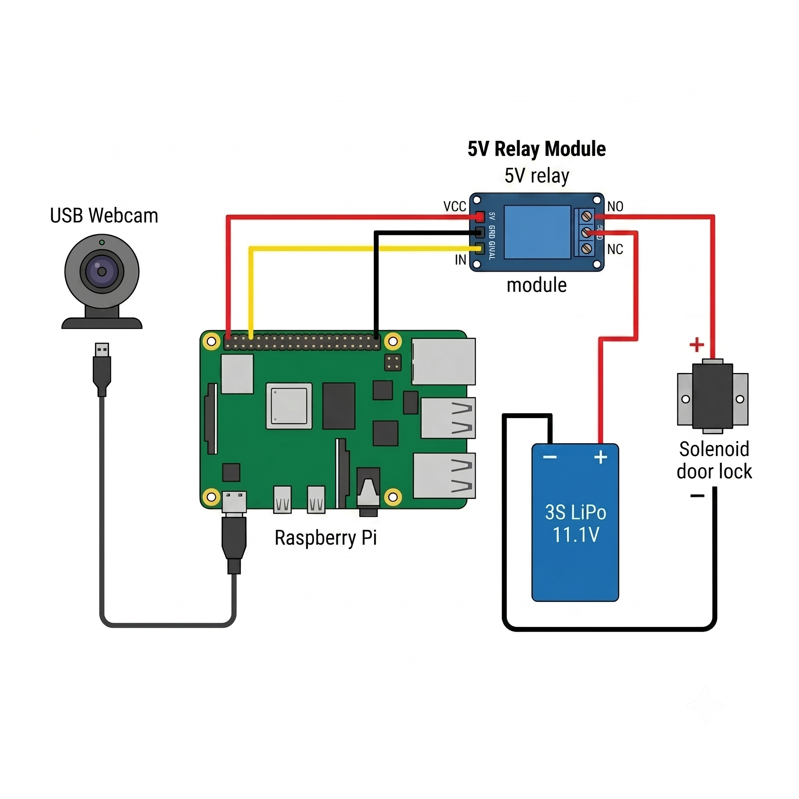
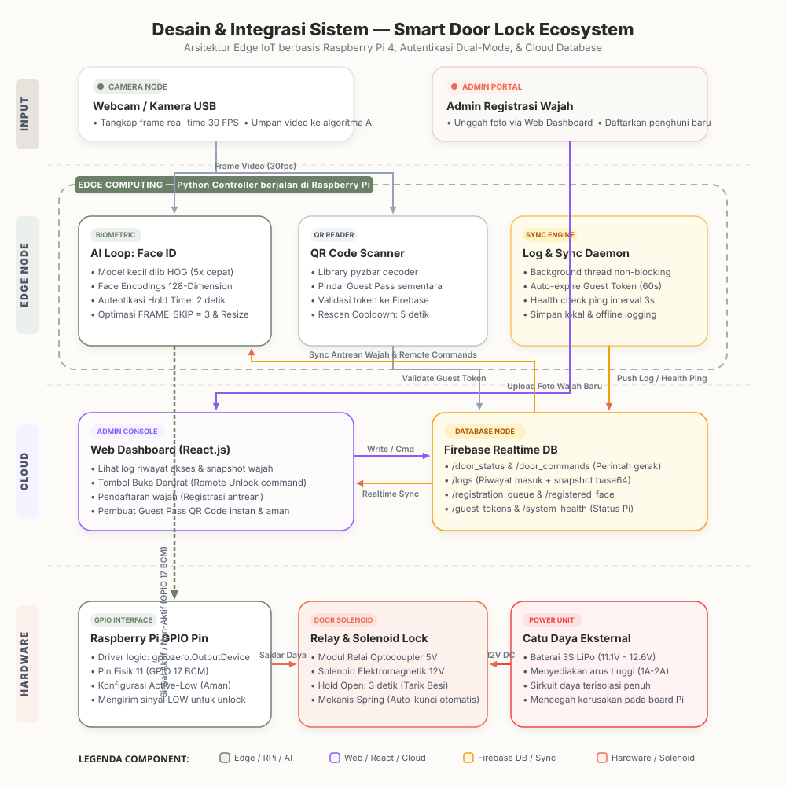

# 🚪 Anzen Smart Door Lock System

An intelligent, real-time IoT security system featuring dual-mode authentication via **Facial Recognition (Face ID)** and **Cryptographically Secure QR Code Guest Passes**. The edge node runs on a Raspberry Pi and directly controls the solenoid door lock using the Pi's GPIO pins, all coordinated in real-time through Firebase Realtime Database with web and mobile dashboards.

---

## 📸 System Ecosystem Diagrams

### 1. Hardware Connections
The hardware setup consists of a Raspberry Pi acting as the main controller. It is connected via USB to a webcam and connects directly to a 5V relay module via its GPIO header pins. The relay controls the high-current electrical circuit from the 3S battery to the solenoid.



### 2. Software Architecture
The system is divided into three primary software modules synchronized in real-time through a centralized Firebase database.


### 3. Integrated System Architecture
This unified system diagram illustrates the real-time input flow, Edge Node execution (Raspberry Pi 4), Cloud sync via Firebase, and final hardware actuation:



---

## 🛠️ Hardware Ecosystem

### Components Used
*   **Raspberry Pi (Edge Node)**: The core brain of the system. Processes video frames, runs facial recognition, scans QR codes, handles database synchronization, and drives the GPIO pins.
*   **Webcam**: Connected via USB to the Raspberry Pi to capture real-time video feeds (30 FPS).
*   **5V Optocoupler Relay Module**: Connected directly to the Raspberry Pi GPIO header. It safely isolates the Pi's logic board from the high-current/voltage battery circuit.
*   **3S Lithium Polymer Battery (11.1V - 12.6V)**: Powers the solenoid door lock, providing high instantaneous currents (approx. 1A-2A).
*   **12V Solenoid Door Lock**: An active-low electronic bolt that pulls back when the relay connects the battery loop.

### 🔌 Physical Wiring & GPIO Connections

The relay is triggered directly from the Raspberry Pi GPIO pins:

1.  **Raspberry Pi to Relay Module**:
    *   `VCC` (Relay Power) ➔ Raspberry Pi Physical Pin `2` or `4` (**5V Power**)
    *   `GND` (Relay Ground) ➔ Raspberry Pi Physical Pin `6` (**Ground**)
    *   `IN` (Relay Signal) ➔ Raspberry Pi Physical Pin `11` (**GPIO 17**) (Active-Low trigger)
2.  **Relay to Power & Solenoid Circuit**:
    *   `3S Battery (+)` ➔ Relay **COM** (Common Terminal)
    *   Relay **NO** (Normally Open Terminal) ➔ Solenoid **(+)**
    *   `3S Battery (-)` ➔ Solenoid **(-)**

> [!WARNING]
> Do **not** connect the 12V solenoid directly to the Raspberry Pi GPIO pins. The solenoid requires a high current draw that will instantly fry the Raspberry Pi's processor. The solenoid must be driven from the 3S battery and switched safely using the relay.

---

## 💻 Software Ecosystem

The system contains three main application layers:

### 1. Edge Controller (`/ai-controller`)
A highly-optimized Python-based AI agent running locally on the Raspberry Pi.
*   **High-Speed Face ID**: Employs `face_recognition` (powered by `dlib`) and OpenCV for 128-dimension face encodings. To optimize performance on the Raspberry Pi:
    *   Face recognition runs on every 3rd frame (`FRAME_SKIP = 3`).
    *   Frames are resized to 25% for detection speed.
    *   Uses model `"small"` for 5x faster processing.
    *   Skips upscaling (`number_of_times_to_upsample=0`).
*   **QR Scanner**: Employs `pyzbar` to decode QR codes in-frame for checking guest pass tokens against Firebase.
*   **Relay Controller**: Directly controls Raspberry Pi GPIO Pin 17 using the object-oriented `gpiozero.OutputDevice` library. Configured as `active_high=False` to support active-LOW relay modules.
*   **Daemon Auto-Expire**: A background Python thread that sweeps and invalidates expired guest tokens in the database every 60 seconds.
*   **Non-Blocking Firebase Logger**: Uses an asynchronous background logging thread (`push_log_async`) to prevent database write latency from blocking the main camera loop.

### 2. Admin Web Panel (`/smart-door-admin`)
A premium web dashboard built with **React 19, TypeScript, and Vite**, hosted at [face-door-recog.vercel.app](https://face-door-recog.vercel.app).
*   **Status & Health Monitor**: Checks CPU health, camera status, and relay system health of the Edge Pi.
*   **Remote Control Override**: Instantly triggers door unlock commands remotely over the cloud.
*   **Secure QR Generator**: Generates cryptographically secure, single-use, time-limited QR codes for temporary guests.
*   **Access Logs**: Displays comprehensive histories containing visitor names, entry methods, timestamps, and cropped snapshot images.
*   **Web Face Enrollment**: Uploads new user photos to the `registration_queue` so the edge node can download, register, and sync their biometric signatures.

### 3. Android Mobile Application (`/smart-door-android`)
A mobile client wrapped using **Capacitor** + React + TS to control system configurations and receive push notifications on mobile devices.

---

## 🗄️ Firebase Realtime Database Schema

```yaml
/door_status       # "Open" | "Closed" | "Unlocked"
/door_commands/    # Push keys containing command queues: { command: "OPEN", requestedBy: "admin@email.com" }
/logs/             # Pushed records: { name: "MAX", method: "Face ID", timestamp: "YYYY-MM-DD HH:MM:SS", snapshot: "base64..." }
/registration_queue/# New enrollments: { name: "John", image_base64: "base64..." }
/registered_face/  # Verified face profiles synced to the cloud.
/guest_tokens/     # One-time tokens: { guestName: "Tamo", token: "Q478KHRR", status: "active"|"used"|"expired", expiresAt: "ISO_Date" }
/system_health/    # Pi heartbeat: { last_seen: Timestamp, camera_active: bool, relay_active: bool, qr_enabled: bool }
```

---

## ⚙️ Edge GPIO Controller Logic

Your code uses `gpiozero.OutputDevice` to toggle the active-low relay pin. When access is verified, it launches a thread to command the relay while the main thread waits with a safe timeout:

```python
import time
import threading
from gpiozero import OutputDevice

GPIO_RELAY_PIN = 17       # BCM GPIO 17 (Physical Pin 11)
RELAY_HOLD_TIME = 3       # 3 seconds active unlock time

# Initialize Relay (Active Low: pin goes LOW to activate, start with inactive=HIGH)
try:
    relay_pintu = OutputDevice(GPIO_RELAY_PIN, active_high=False, initial_value=False)
    print(f"[SUCCESS] ✅ Relay solenoid siap di GPIO {GPIO_RELAY_PIN}.")
except Exception as e:
    print(f"[ERROR] Gagal inisialisasi relay GPIO: {e}")
    relay_pintu = None

def buka_pintu_relay():
    """Aktifkan relay selama RELAY_HOLD_TIME detik lalu matikan kembali."""
    if relay_pintu is None:
        print("[WARNING] Relay tidak tersedia. Simulasi buka pintu.")
        return False
    try:
        relay_pintu.on()                  # Relay ON (solenoid draws, door opens)
        time.sleep(RELAY_HOLD_TIME)       # Hold open
        relay_pintu.off()                 # Relay OFF (solenoid releases, door locks)
        return True
    except Exception as e:
        print(f"[ERROR] Gagal mengontrol relay: {e}")
        relay_pintu.off()                 # Ensure relay is OFF on error
        return False
```

### execution Thread inside the camera loop:
```python
# Launch the relay thread to trigger hardware
hasil = [False]
def _trigger_relay():
    hasil[0] = buka_pintu_relay()

relay_thread = threading.Thread(target=_trigger_relay, daemon=True)
relay_thread.start()
relay_thread.join(timeout=RELAY_HOLD_TIME + 2)
hardware_ok = hasil[0]
```

> [!IMPORTANT]
> The relay uses `active_high=False` because standard 5V blue relay modules are Active-LOW. Pulling the control line LOW completes the internal optocoupler circuit to trigger the relay.

---

## 🚀 Setup & Installation

### Edge Node Setup (`ai-controller`)
1.  **Install System Dependencies** (On Linux/Raspberry Pi):
    ```bash
    sudo apt-get update
    sudo apt-get install cmake libopenblas-dev liblapack-dev libx11-dev libgtk-3-dev zlib1g-dev libjpeg-dev libpng-dev -y
    sudo apt-get install zbar-tools -y
    ```
2.  **Virtual Environment & Python Packages**:
    ```bash
    cd ai-controller
    python -m venv .venv
    # Activate environment:
    # Windows: .\.venv\Scripts\activate | Linux: source .venv/bin/activate
    pip install -r requirements.txt
    ```
    *(Note: For Windows development, a precompiled wheel `dlib-19.22.99-cp310-cp310-win_amd64.whl` is provided in the root of the folder).*
3.  **Firebase Credentials**:
    Place your Google service account private key file named `serviceAccountKey.json` inside the `ai-controller/` directory.

4.  **Run Controller**:
    ```bash
    python main.py
    ```

### Admin Panel Setup (`smart-door-admin`)
1.  Install dependencies:
    ```bash
    cd smart-door-admin
    npm install
    ```
2.  Set up environment configurations:
    Create a `.env.local` file and add your web Firebase API credentials.
3.  Start local dashboard:
    ```bash
    npm run dev
    ```
